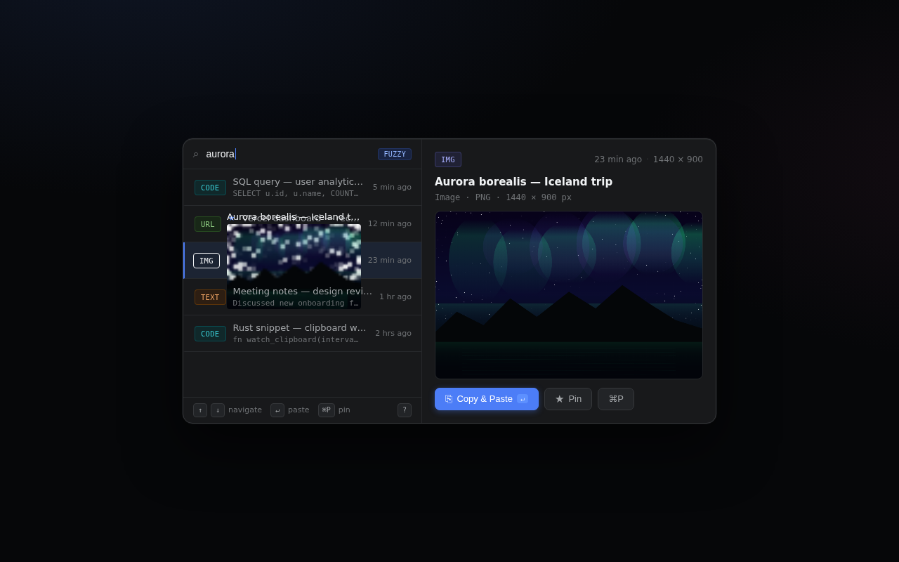
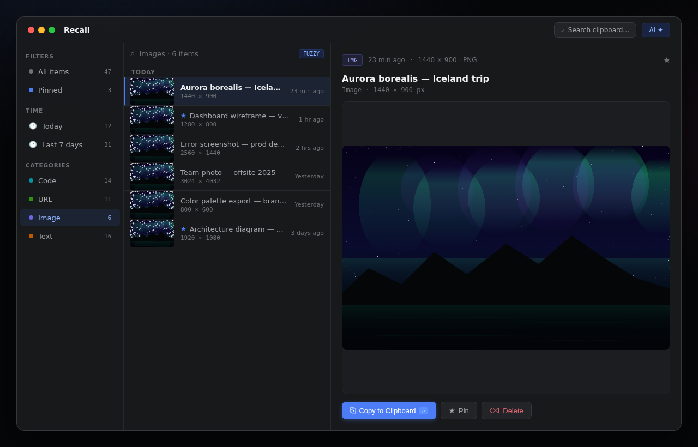

<div align="center">

# Recall

**Your clipboard, with natural-language recall.**

<sub>"that CSS snippet from yesterday" · "the phone number I copied last week" · "the error from the terminal earlier"</sub>

---

**Recall is in early development** — we're building in public. Try it, break it, tell us what to fix next.

</div>

---

## Image Copy & Paste

Copy any image — screenshots, photos, diagrams — and Recall captures it automatically. Open the palette, find it by description, and paste it back in one keystroke.

<video src="public/recordings/image-copy-paste.webm" autoplay loop muted playsinline width="100%"></video>

### Quick-access palette with image preview

Press `Ctrl+Shift+Space`, type a description, and your image appears instantly in the preview pane — full resolution, ready to paste.

<p align="center">
  
</p>

### Library view with image category filter

Browse and manage all your captured images in one place. Filter by the **Image** category, see thumbnails at a glance, and open any image full-size in the preview pane.

<p align="center">
  
</p>

---

## What's Recall?

Recall is a local-first clipboard history manager for **Windows, Linux, and macOS**. It captures everything you copy, categorizes it automatically, and lets you find it again with either fuzzy search or AI-powered semantic search.

The entire "find → paste" loop takes under five seconds. Semantic search works out of the box — no API key, no cloud, no account, no telemetry.

## Why Recall?

| Problem | Recall's Solution |
|--------|-------------------|
| "I know I copied that link but can't find it" | Semantic search — describe what you remember, not what you copied |
| "Clipboard managers are cluttered / slow" | 500ms capture, SQLite+FTS5, keyboard-first UI |
| "I want AI but don't trust cloud with my data" | Local embeddings (BGE Small ONNX) — runs entirely on your machine |
| "I do want cloud embeddings sometimes" | Optional: OpenAI, Ollama, or keep it local |
| "I want AI labels but not monthly fees" | Optional Anthropic key — you control your usage and spend |

## Features

- **Silent auto-capture** — every copy lands in history within 500ms
- **Image capture & paste** — screenshots and images captured automatically; full-resolution preview and one-key paste-back
- **Auto-categorization** — clips sorted into `code`, `url`, `email`, `phone`, `color`, `path`, `text`, `address`, `number`, or `image`
- **Semantic search out of the box** — bundled ONNX model (~130 MB) runs entirely on-device. No API key needed.
- **Fuzzy search** — keystroke-level fast, SQLite FTS5 with BM25 ranking
- **Hybrid results** — semantic + fuzzy mixed via Reciprocal-Rank-Fusion
- **Optional cloud providers** — swap local model for OpenAI (`text-embedding-3-small`) or Ollama
- **Raycast-style palette** — `Ctrl+Shift+Space` from anywhere, type, paste
- **Pin, rename, soft-delete with undo** — 4-second grace window
- **Native tray + global shortcut + launch-at-startup**
- **Mica-blur on Windows 11**, light/dark themes, adjustable accent, density, fonts
- **Keyboard-first** — every action has a shortcut; press `?` for cheatsheet

## Install

Pre-built installers are attached to every [GitHub Release](../../releases). macOS builds available via source.

### Windows

| File | What it is |
|---|---|
| `Recall_<version>_x64-setup.exe` | NSIS installer — recommended |
| `Recall_<version>_x64_en-US.msi`  | MSI installer — for managed environments |

### Linux

| File | What it is |
|---|---|
| `recall_<version>_amd64.AppImage` | Portable binary — works on most distros |
| `recall_<version>_amd64.deb`      | Debian/Ubuntu/PopOS package |

### macOS

Build from source: `make build` (produces `.dmg`)

> **Wayland note:** Global shortcuts restricted on Wayland. Bind your DE's shortcut to `recall --palette` instead.

## Quick Start

1. Install and launch — app runs in system tray
2. Copy anything — text, links, code, images
3. Press `Ctrl+Shift+Space` — palette opens
4. Type what you're looking for — fuzzy or semantic
5. `Enter` to paste

## Keyboard Shortcuts

| Shortcut | Action |
|---|---|
| `Ctrl+Shift+Space` | Toggle palette (rebindable) |
| `?` | Keyboard cheatsheet |
| `↑` `↓` or `J` `K` | Navigate |
| `Enter` | Paste selected |
| `Tab` | Toggle fuzzy ↔ semantic |
| `Ctrl+P` | Pin / unpin |
| `Ctrl+Backspace` | Delete |

## Configuring AI

Click the **AI** button in the top-right. Two independent features:

1. **Semantic search** — on by default, local ONNX model. Swap to OpenAI or Ollama if preferred.
2. **AI intent labels** — paste an Anthropic key for one-line summaries ("Stripe webhook debug snippet", "login URL"). Off by default.

## Status: Early Alpha

Recall is being built in public. Things may break. Features may change. We're shipping fast and listening to feedback.

**Current limitations:**
- macOS builds require building from source
- Some polish items (animations, edge cases) in progress
- Documentation improving daily

**Coming soon:**
- Sync across devices (local network option)
- More category heuristics
- Plugin/extension API

## Architecture

| Concern | Implementation |
|---|---|
| Framework | **Tauri v2** — Rust backend, React + TypeScript frontend |
| Storage | SQLite + FTS5 + vector column |
| Clipboard | `arboard` crate, 500ms polling + SHA-256 dedupe |
| Local embeddings | `fastembed-rs` + ONNX Runtime |
| Search | Reciprocal-Rank-Fusion of BM25 + cosine |

## Building from Source

```sh
# Linux
./build.sh install && ./build.sh build

# Windows
.\build.ps1 install; .\build.ps1 build

# macOS (via make)
make install && make build
```

## Privacy

- All data stored locally in SQLite — never leaves your machine
- Embeddings stored as float32 in same DB row
- Model downloaded once from Hugging Face, then fully offline
- Network calls only if you configure cloud providers
- No telemetry, no analytics, no accounts

## Let's Build Together

- ⭐ Star us on GitHub
- 🐛 Report bugs
- 💡 Request features
- 🗣️ Spread the word

**Recall** — find anything you ever copied.